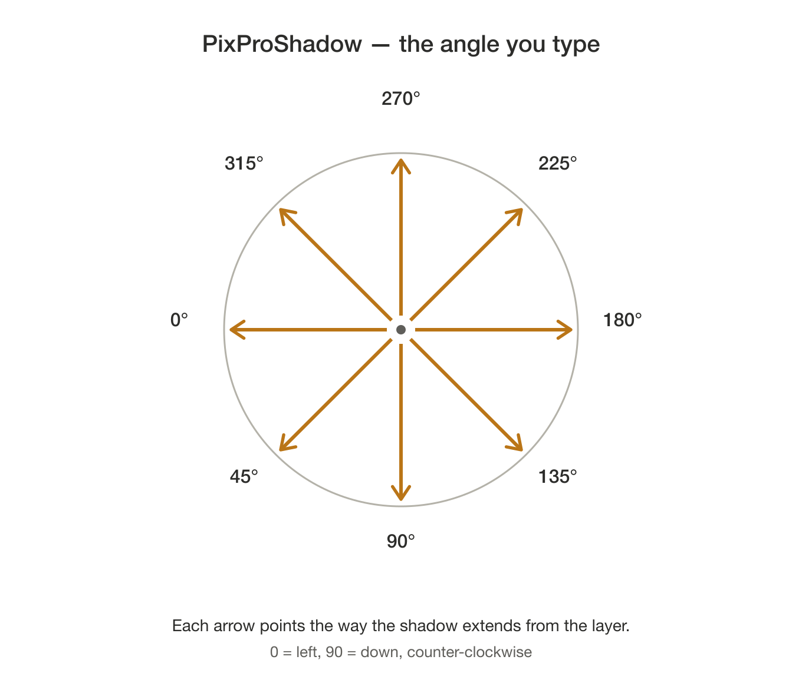

# PixProShadow 7.6.6

Builds a deep extruded shadow — the long-shadow, 3-D block look — behind a
Pixelmator Pro layer, from a stack of offset copies merged into one layer.

### [⬇︎ Download the latest release](https://github.com/spurious-cox/pixproshadow/releases/latest)

Notarized and stapled by Apple — open the DMG and drag PixProShadow to Applications,
or install it with Homebrew:

```
brew install --cask spurious-cox/tap/pixproshadow
```
Requires Pixelmator Pro. Both the 3.x build and the Creator Studio build work;
the app binds to whichever one is in front or has a document open.

## Using it

1. Select the one layer you want the shadow behind. Text, shape and image
   layers all work. It has to be at the **top level** of the Layers list; if
   it is inside a group, drag it out first and move the result back afterward.
2. Run PixProShadow.
3. Pick the two gradient colors. The picker opens twice: **start** (closest to
   the layer) then **end** (the deepest part of the shadow).
4. Enter `angle / depth`, for example `45 / 25`. The angle runs
   counter-clockwise — 0 = left, 90 = down, 180 = right, 270 = up — and depth
   takes pixels, millimeters (`5mm`) or math (`72/25.4*5`). The prompt suggests
   a depth that suits the selected layer.

   

## What you get

A group named after the source layer: a pixel copy, the merged shadow, and your
original untouched at the bottom.

## How it works

Position is read from the pixels rather than from the layer's reported frame —
Pixelmator reports a shape's path bounds and a text layer's typographic bounds,
neither of which is what actually gets drawn. Copies are offset one step at a
time along the angle, each a little further toward the end color, then merged
into a single shadow layer beneath the original.

## Building

```
osacompile -o /tmp/PixProShadow.scpt PixProShadow.applescript
```

The Read Me button opens `PixProShadow-README.rtfd` from the app's Resources: the
text Read Me with `PixProShadow-angles.png` in place of the line that names it.

The app is signed with a timestamped Developer ID certificate, which keeps
macOS's Automation grant alive across rebuilds, then notarized and stapled.

## Problems or suggestions

Open an issue: https://github.com/spurious-cox/pixproshadow/issues

## License

MIT. See [LICENSE](LICENSE).
